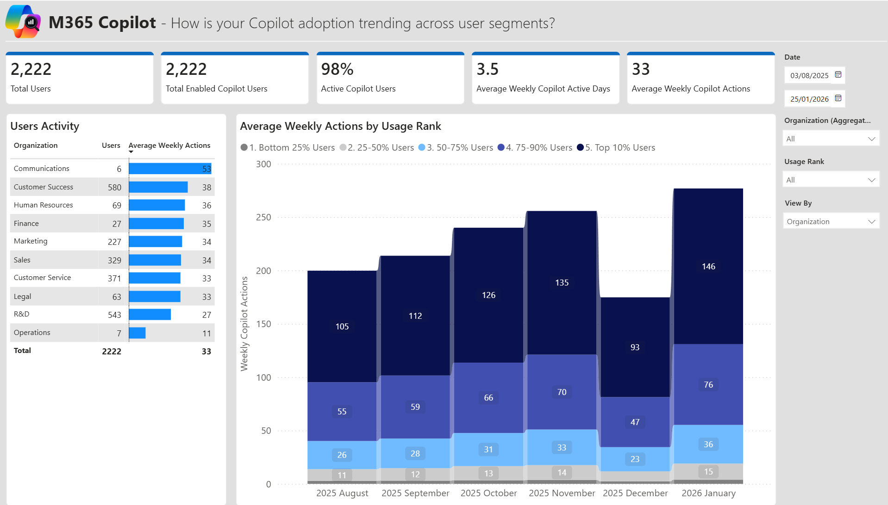
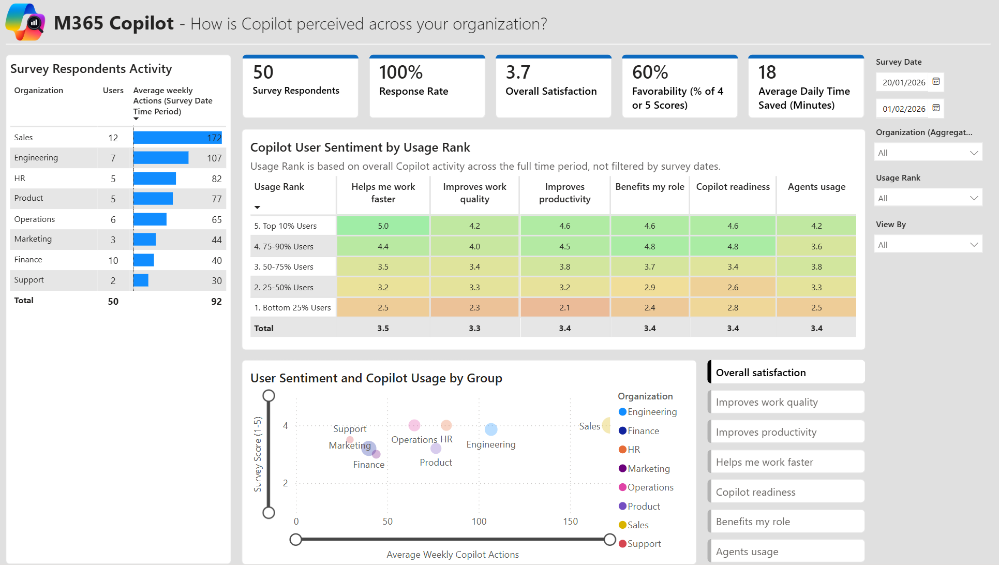
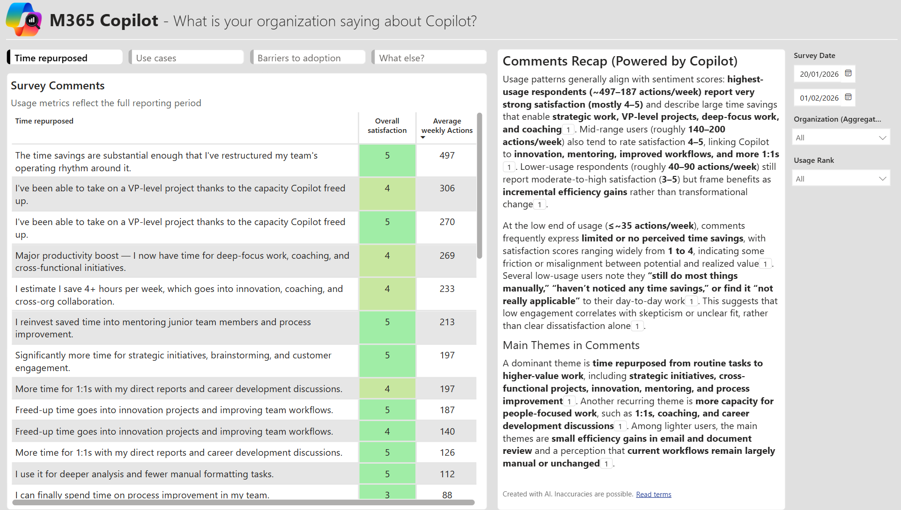
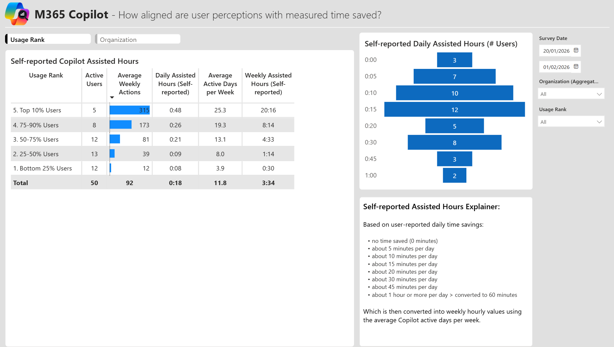
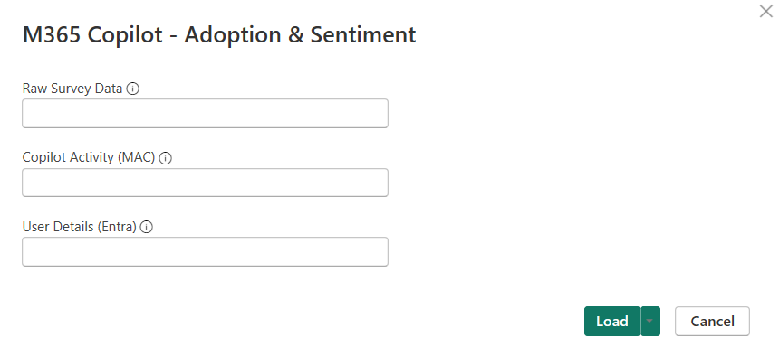

# M365 Copilot — Adoption & Sentiment Report

A Power BI report that combines **Microsoft 365 Copilot usage data** with **employee survey sentiment** to give you a complete picture of Copilot adoption, satisfaction, and self-reported time savings across your organization.

### 📥 [Download or Clone this Repository](#-getting-started)

---

## 📊 What This Report Covers

### 1. 📈 Adoption Overview
*How is your Copilot adoption trending across user segments?*

Start here. Get the big picture: how many users are licensed, how many are actually using Copilot, and how that's trending month over month. Each column shows the average Copilot prompts for that period. Usage is broken down by organization and by usage tier (Bottom 25% through Top 10%) so you can see whether adoption is broad or concentrated.

---

### 2. 📝 Sentiment Analysis
*How do employees feel about Copilot — and does it match their actual usage?*

This is where usage meets sentiment. Correlate survey scores (satisfaction, productivity, speed, readiness) with actual Copilot activity. The scatter plot reveals whether high-usage employees are also the most satisfied — and surfaces pockets where sentiment lags behind usage (or vice versa). Break down by organization and usage tier to identify where enablement efforts should focus.

---

### 3. 🗣️ Comments Analysis
*What are employees actually saying about Copilot?*

Go beyond scores to explore the free-text survey responses — how people repurpose saved time, their top use cases, barriers to adoption, and open-ended feedback. An AI-generated narrative summary highlights key themes. Toggle between comment categories and filter by usage rank to compare what power users say versus those still ramping up.

---

### 4. ⌛ Saved Time Analysis
*How much time are employees actually saving — and does it match the data?*

Compare self-reported daily time savings against actual Copilot usage levels. The funnel chart shows the distribution of time-saved responses, while the table breaks down by usage tier to reveal whether heavy users truly report more savings. Cross-reference with average active days per week and calculated assisted hours to build your time-savings narrative.

---

<strong>🔌 Getting Started</strong>

This report uses **3 CSV files** — one required, two optional — loaded via Power BI parameters.

### Step 1 — Get your data

#### Copilot Activity (MAC) — Required

The core data source. Download the Copilot Activity export from the Microsoft Admin Center.

**How to export:**
1. Go to [admin.microsoft.com](https://admin.microsoft.com) → **Reports** → **Usage** → **Microsoft 365 Copilot**
2. Select the **30-day** report period
3. Click **Export** (top right) to download the CSV
4. The file will be named something like `CopilotActivityUserDetail_YYYY-MM-DD.csv`

> **Important:** To get real user names (not hashed), go to **Settings** → **Org settings** → **Reports** and uncheck *"Display concealed user, group, and site names in all reports"*. Wait 48 hours, then re-export.

To track trends over time, **export monthly** and combine/append the CSVs. The report will automatically detect multiple `Report Refresh Date` values and show month-over-month trends.

#### Raw Survey Data — Optional

Survey responses from Microsoft Forms (or any survey tool) exported as CSV. The file must include an `Email` column containing User Principal Names that match the Copilot Activity export.

**Required columns:**

| Column | Type | Description |
|---|---|---|
| `Email` | Text | User Principal Name (must match Copilot Activity UPNs) |
| `SurveyDate` | Date | When the response was submitted |
| `Overall satisfaction` | Integer (1-5) | Overall satisfaction with Copilot |
| `Helps me work faster` | Integer (1-5) | Speed perception |
| `Improves work quality` | Integer (1-5) | Quality perception |
| `Improves productivity` | Integer (1-5) | Productivity perception |
| `Benefits my role` | Integer (1-5) | Role relevance |
| `Copilot readiness` | Integer (1-5) | Self-assessed readiness |
| `Agents usage` | Integer (1-5) | Copilot agents familiarity |
| `Time saved using Copilot` | Text | e.g. "About 15 minutes per day" |
| `Time repurposed` | Text | How saved time is used |
| `Use cases` | Text | Most valuable use cases |
| `Barriers to adoption` | Text | Adoption blockers |
| `What else?` | Text | Additional comments |

> The `Email` column is automatically detected and renamed internally for the join with usage data.

#### User Details (Entra) — Optional

Adds organization (department) data and display names from Entra ID.

**How to export:**
1. Go to [entra.microsoft.com](https://entra.microsoft.com) → **Users** → **All users**
2. Click **Download users** → **Download**
3. The export includes `userPrincipalName`, `displayName`, and `companyName`

> The `companyName` field maps to the Organization attribute. If it's empty in your tenant, you can manually populate it or add a column to the CSV.

### Step 2 — Open the report

1. Clone or download this repository
2. Double-click `M365 Copilot - Adoption & Sentiment.pbip` to open in **Power BI Desktop** (February 2025 or later)
3. When prompted, configure the three parameters:

| Parameter | What to enter |
|---|---|
| **Raw Survey Data** | Full file path to your survey CSV (or `/` to skip) |
| **Copilot Activity (MAC)** | Full file path to the Admin Center export CSV |
| **User Details (Entra)** | Full file path to the Entra user export CSV (or `/` to skip) |

> ⚠️ Do **not** wrap paths in quotes. Use the full path, e.g. `C:\Data\CopilotActivity.csv`

4. Click **Load** — the data will refresh automatically

---

<strong>📐 How Usage Rank Works</strong>

The report classifies every user into a **Usage Rank** tier based on their average Copilot actions across the full data period:

| Tier | Description |
|---|---|
| **5. Top 10% Users** | The most active Copilot users — power users and champions |
| **4. 75-90% Users** | Strong, consistent users |
| **3. 50-75% Users** | Moderate users — the middle of the bell curve |
| **2. 25-50% Users** | Light users — occasional or task-specific |
| **1. Bottom 25% Users** | Minimal usage — likely need enablement support |

This classification is used throughout the report to correlate usage intensity with sentiment, time savings, and qualitative feedback. It's calculated as a percentile rank across all users with a Copilot license.

**Why it matters:** The most powerful insight in this report comes from comparing tiers — do the Top 10% report higher satisfaction? Are the Bottom 25% flagging specific barriers? This drives targeted adoption actions.

---

<strong>❓ FAQ</strong>

**The Admin Center export shows hashed user names — how do I fix this?**

Go to **Microsoft 365 Admin Center** → **Settings** → **Org settings** → **Reports** and uncheck *"Display concealed user, group, and site names in all reports"*. Wait 48 hours, then re-export.

**Organization column is empty — what's wrong?**

The Organization data comes from the `companyName` field in the Entra export. If it's not populated in your tenant, you can either populate it in Entra ID, manually add an Organization column to the CSV, or use a different attribute.

**Survey data isn't joining with usage data**

Ensure the `Email` column in your survey CSV contains the same UPN format as the Admin Center export (e.g. `user@contoso.com`). The report automatically lowercases and trims both sides for matching.

**Can I use this with Viva Insights data instead?**

This version is designed for Admin Center (MAC) exports. For Viva Insights (Copilot Dashboard or custom person query) with feature-level breakdowns and native Assisted Hours, see the [Adoption & Impact Report (Lite)](https://github.com/microsoft/copilot-adoption-impact-report).

**Feature-level breakdowns show 0 — is that expected?**

Yes. The Admin Center export only provides total prompts and active days — not per-feature actions. For feature-level detail, use Viva Insights.

---

## 🔗 Related Templates & Tools

- [Copilot Adoption & Impact Report (Lite)](https://github.com/microsoft/copilot-adoption-impact-report) — ROI analysis & feature-level usage with Viva Insights or Dashboard export
- [Super User Adoption Analysis](https://github.com/microsoft/DecodingSuperUsage) — Deep dive into super user patterns
- [AI-in-One Dashboard](https://github.com/microsoft/AI-in-One-Dashboard) — Unified AI analytics

---

## 📝 License

This project is licensed under the [MIT License](LICENSE).

---

## 💬 Feedback

Found a bug or have a feature request? Open an issue or contact [opecheux@microsoft.com](mailto:opecheux@microsoft.com).
